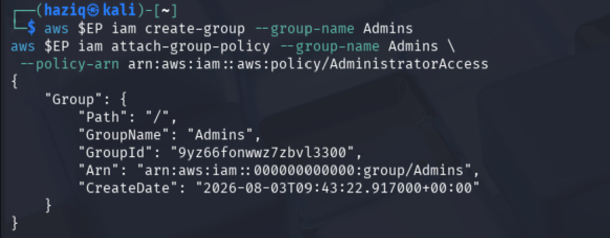
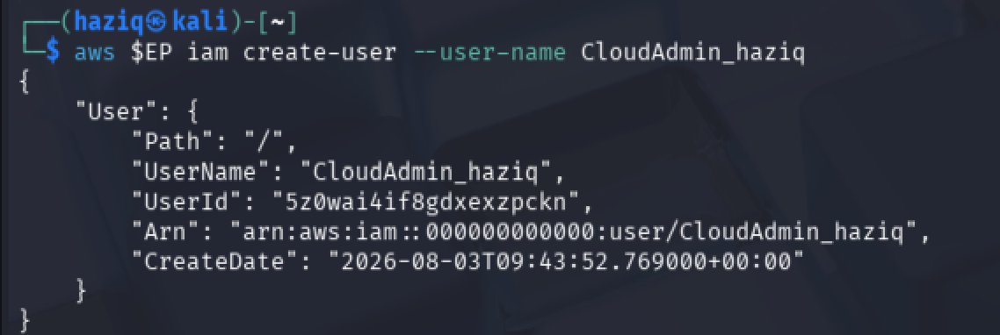
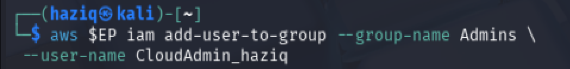
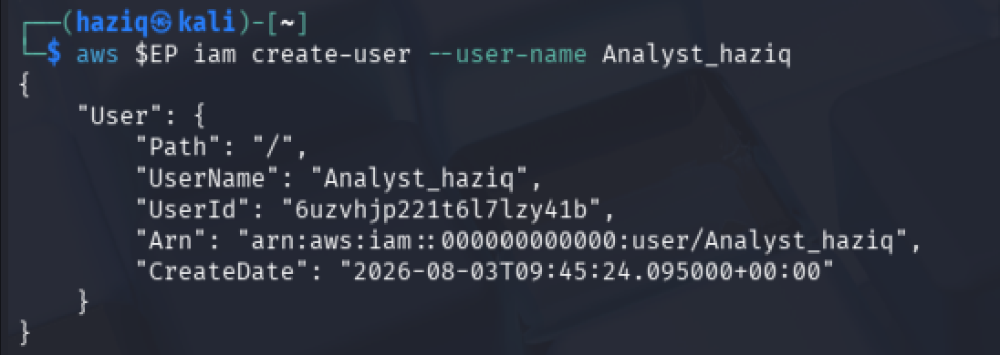
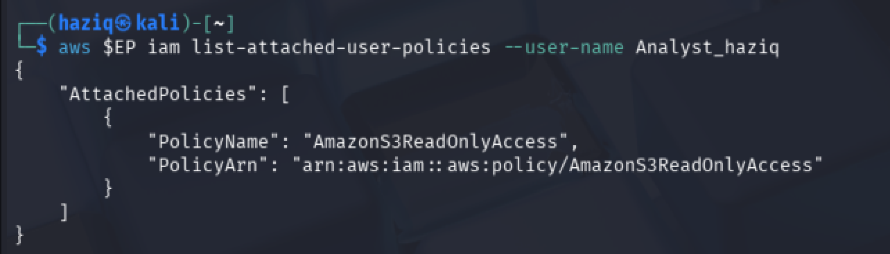
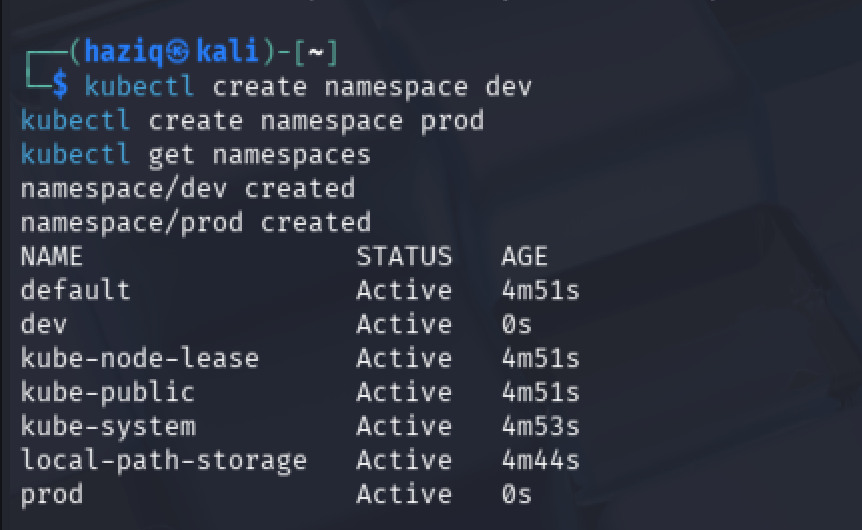
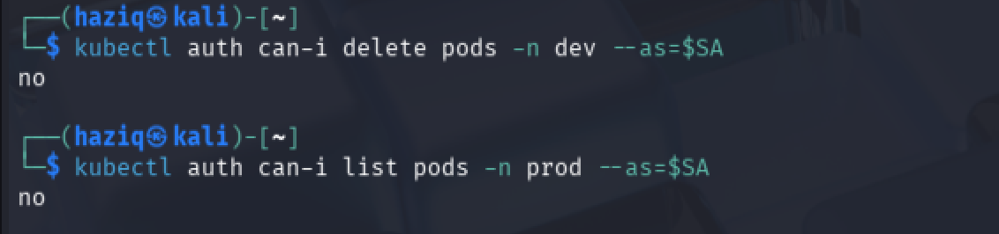

# IKB42603 Cloud Computing Security Essentials

## LAB 1 WEEKS 1-2: Cloud Account Security, Identity & Access Management

**Identity governance and least privilege: LocalStack IAM & Kubernetes RBAC**

---

### Course & Assessment Mapping

| Item | Mapping |
|---|---|
| **Course Learning Outcome** | CLO2 – Construct secure cloud operations that safeguard data integrity |
| **Lecture topics** | Weeks 1-2 (Fundamentals, Security Architecture); Weeks 5 & 7 (Access Control, Identity) |
| **Value / skill clusters** | VBE3 (Integrity); SC8 (Integrated Problem-Solving) |
| **Assessment** | Lab report (screenshots + CLI output + short answers), contributes to the Lab Assignment |

---

### Lab Arrangement (2 Sessions over 2 Weeks)

| Session | Week | Focus |
|---|---|---|
| **Session A** | Week 1 | Environment setup + cloud identity with LocalStack IAM (Tasks 1–4) |
| **Session B** | Week 2 | Enforced access control with Kubernetes RBAC + audit (Tasks 5–7), then the report |

> **Note:** Session A was completed fully before starting Session B. Commands and screenshots were kept throughout, as required for this report.

---

### Technical Prerequisites

- A laptop with at least 8 GB RAM and administrator rights to install software
- Docker Desktop / Docker Engine
- AWS CLI v2 (pointed at LocalStack, not real AWS)
- `kind` (Kubernetes-in-Docker) and `kubectl`
- Internet access only for the first download of container images

> **Security tip:** Nothing in this lab connects to a real cloud provider — LocalStack emulates AWS APIs locally, and `kind` runs Kubernetes inside Docker on this machine.

---

# Session A (Week 1): Cloud Identity with LocalStack

## One-Time Environment Setup

```bash
# 1. Confirm Docker is installed and running
docker --version

# 2. Start LocalStack (AWS-compatible cloud) in a container
docker run -d --name localstack -p 4566:4566 localstack/localstack

# 3. Confirm it is healthy (should list running services)
curl http://localhost:4566/_localstack/health
```

```bash
# Configure dummy credentials (LocalStack accepts any value)
aws configure set aws_access_key_id test
aws configure set aws_secret_access_key test
aws configure set region us-east-1

# Test: this talks to LocalStack, NOT real AWS
aws --endpoint-url=http://localhost:4566 sts get-caller-identity
```

**Evidence — health check & credential configuration:**


---

## Task 1: Map the Cloud Identity Landscape

| Concept | AWS term | Purpose |
|---|---|---|
| **All-powerful owner** | Root user | The identity created automatically when the account is opened. It has unrestricted access to every resource and billing setting, which is exactly why it should never be used for everyday work — it should be locked away (MFA-protected) and reserved for account-level emergencies only. |
| **Human/app identity** | IAM User | A named identity for a specific person or application that needs to authenticate individually, typically with its own password and/or access keys. |
| **Permission bundle** | IAM Policy | A JSON document that states exactly which actions are allowed or denied on which resources. Policies are how least privilege is actually expressed in AWS. |
| **Collection of users** | IAM Group | A container of IAM users that lets an administrator manage permissions for many people at once by attaching a policy to the group instead of to each user. |
| **Temporary identity** | IAM Role | An identity with no long-term credentials of its own — it is *assumed* (by a user, application, or AWS service) for a limited session, after which the temporary credentials expire. |

**Evidence — operating identity (`sts get-caller-identity`):**


---

## Task 2: Create a Least-Privilege Admin (Stop Using Root)

```bash
EP='--endpoint-url=http://localhost:4566'

# 2.1 Create a group and attach an admin policy to the GROUP
aws $EP iam create-group --group-name Admins
aws $EP iam attach-group-policy --group-name Admins \
  --policy-arn arn:aws:iam::aws:policy/AdministratorAccess

# 2.2 Create a personal admin user
aws $EP iam create-user --user-name CloudAdmin_haziq

# 2.3 Put the user in the group (permissions flow from the group)
aws $EP iam add-user-to-group --group-name Admins \
  --user-name CloudAdmin_haziq

# 2.4 Verify the membership
aws $EP iam get-group --group-name Admins
```

**Evidence:**






> **Security tip:** Attaching policies to groups (not users) is how permissions stay manageable and auditable at scale — change the group once, and every member updates automatically.

---

## Task 3: Enforce Least Privilege with a Scoped Policy

```bash
# 3.1 Create a read-only user
aws $EP iam create-user --user-name Analyst_haziq

# 3.2 Attach a scoped, read-only policy (S3 read-only)
aws $EP iam attach-user-policy --user-name Analyst_haziq \
  --policy-arn arn:aws:iam::aws:policy/AmazonS3ReadOnlyAccess

# 3.3 List what the user can do
aws $EP iam list-attached-user-policies --user-name Analyst_haziq
```

**Evidence:**





**Blast-radius reduction:** the Analyst identity holds only `AmazonS3ReadOnlyAccess`. If those credentials leaked, an attacker could read S3 object data but could not delete or modify anything, spin up infrastructure, touch other services, or create new identities — compared to a stolen admin credential, which would expose the entire account.

---

## Task 4: Credential Hygiene & Access Keys

```bash
# 4.1 Create an access key for the Analyst
aws $EP iam create-access-key --user-name Analyst_haziq

# 4.2 List access keys (note the AccessKeyId and status)
aws $EP iam list-access-keys --user-name Analyst_haziq

# 4.3 Rotate: deactivate the old key
aws $EP iam update-access-key --user-name Analyst_haziq \
  --access-key-id <PASTE_KEY_ID> --status Inactive
```

**Evidence:**


> **Caution:** In real AWS, never create access keys on the root user and never commit keys to a repository. Prefer short-lived roles over long-lived keys wherever possible.

---

# Session B (Week 2): Enforced Access Control with Kubernetes RBAC

LocalStack demonstrates the *mechanics* of IAM, but doesn't enforce anything end-to-end. Kubernetes RBAC does — this session shows access control actually blocking an unauthorised action.

## Environment Setup: Create a Local Kubernetes Cluster

```bash
kind create cluster --name ccse-lab1
kubectl cluster-info --context kind-ccse-lab1
kubectl get nodes
```

**Evidence:**


---

## Task 5: Separate Environments with Namespaces

```bash
kubectl create namespace dev
kubectl create namespace prod
kubectl get namespaces
```

## Task 6: Define a Role and Bind It (Least Privilege)

```bash
# 6.1 Create a service account to represent a developer
kubectl create serviceaccount dev-user -n dev

# 6.2 Create a Role that allows only get/list/watch on pods in dev
kubectl create role pod-reader -n dev \
  --verb=get,list,watch --resource=pods

# 6.3 Bind the Role to the service account
kubectl create rolebinding dev-user-binding -n dev \
  --role=pod-reader --serviceaccount=dev:dev-user
```

**Evidence:**




---

## Task 7: Test That Access Control Works

```bash
SA="system:serviceaccount:dev:dev-user"

# Should be YES - reading pods in dev is allowed
kubectl auth can-i list pods -n dev --as=$SA

# Should be NO - deleting pods is not granted
kubectl auth can-i delete pods -n dev --as=$SA

# Should be NO - the role does not extend to prod
kubectl auth can-i list pods -n prod --as=$SA
```

**Evidence — results (YES / NO / NO):**


> **Security tip:** This is least privilege enforced by the platform itself — the developer can do exactly what the Role permits and nothing more, and `prod` stays off-limits even inside the same cluster.

---

# Deliverables & Assessment Answers

## 1. Short-Answer Questions

**Q1. Why is attaching policies to groups better than attaching them directly to users?**

Groups centralize permission management. When someone's role changes, an admin adds or removes them from the relevant group instead of editing individual policy attachments one user at a time. This keeps every member of a group on the same, consistent permission set, avoids permission drift as the team grows, and makes an audit much simpler — "who can do X" is answered by "who is in this group," not by inspecting every user separately.

**Q2. What is the difference between an IAM User and an IAM Role?**

An IAM User is a permanent identity with long-lived credentials (a password and/or access keys) tied to one specific person or application. An IAM Role has no credentials of its own — it is *assumed* temporarily by a trusted user, application, or AWS service, which receives short-lived, auto-expiring credentials for the duration of that session. Roles are the safer choice whenever a workload doesn't need a permanent identity.

**Q3. Explain least privilege using the Analyst account, and how it reduces blast radius if compromised.**

Least privilege means granting only the permissions an identity actually needs to do its job — nothing more. The Analyst account in this lab was scoped to `AmazonS3ReadOnlyAccess` only. If those credentials were stolen, the attacker could read S3 data but could not delete, modify, or create resources, touch other AWS services, or escalate privileges. That containment is the "blast radius": a narrowly scoped identity limits the damage a compromise can do, whereas a stolen admin credential would expose the entire account.

**Q4. In Kubernetes, what is the difference between a Role and a RoleBinding?**

A Role defines *what* is allowed — a set of verbs (`get`, `list`, `delete`, etc.) on a set of resource types (`pods`, `services`, etc.), scoped to one namespace. A RoleBinding defines *who* gets that Role — it links the Role to a subject (a ServiceAccount, User, or Group). Neither one does anything on its own: a Role with no binding grants nobody access, and there's no such thing as a binding without a Role to point to.

**Q5. Why did the developer service account fail to access prod, and which security principle does that demonstrate?**

The `pod-reader` Role and its `dev-user-binding` RoleBinding were both created in, and scoped to, the `dev` namespace only. Kubernetes RBAC has no concept of "allow everywhere by default" — access is denied unless a matching Role + RoleBinding explicitly grants it, and none existed for `prod`. This demonstrates least privilege and default-deny authorization, plus namespace-based environment isolation (a compromised or over-eager dev identity cannot reach production).

---

## 2. Authentication vs. Authorization Analysis

All three `kubectl auth can-i` checks used the same identity, `system:serviceaccount:dev:dev-user`, so **authentication** succeeded identically in every case — Kubernetes recognized the service account token as valid each time. What differed was **authorization**:

- `list pods -n dev` → **YES**: matches the `get/list/watch` verbs the `pod-reader` Role grants in `dev`.
- `delete pods -n dev` → **NO**: `delete` was never included in the Role's verb list, so the API server has no matching rule and denies it.
- `list pods -n prod` → **NO**: the Role and RoleBinding only exist in `dev`; there is no rule at all covering `prod`, so it's denied by default.

In short: authentication answers "who are you," and passed every time here; authorization answers "what are you allowed to do," and it's the layer that blocked the last two calls.

---

## 3. Verification Command Output

```yaml
# kubectl get rolebinding dev-user-binding -n dev -o yaml

apiVersion: rbac.authorization.k8s.io/v1
kind: RoleBinding
metadata:
  name: dev-user-binding
  namespace: dev
roleRef:
  apiGroup: rbac.authorization.k8s.io
  kind: Role
  name: pod-reader
subjects:
- kind: ServiceAccount
  name: dev-user
  namespace: dev
```

**Evidence:**



---

## Security Best-Practices Checklist

- [x] Root user is not used for daily tasks (a dedicated admin identity exists)
- [x] Permissions are granted via groups/roles, not directly to individual users
- [x] At least one least-privilege (read-only) identity was created and tested
- [x] Access keys were listed and a rotation (deactivate) was demonstrated
- [x] Kubernetes RBAC blocks an unauthorized action (delete / cross-namespace)

---

## Cleanup & Teardown

```bash
# Remove the Kubernetes cluster
kind delete cluster --name ccse-lab1

# Stop and remove LocalStack
docker stop localstack && docker rm localstack
```

---

## References

1. Course lectures — Week 1 (Fundamentals), Week 2 (Security Architecture), Week 5 (Access Control), Week 7 (Identity Management)
2. LocalStack documentation — `docs.localstack.cloud`
3. Kubernetes RBAC — `kubernetes.io/docs/reference/access-authn-authz/rbac`
4. CSA Security Guidance v5 — Domain on Identity & Access Management
