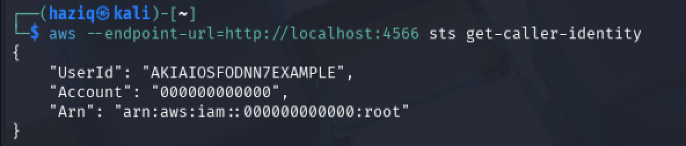
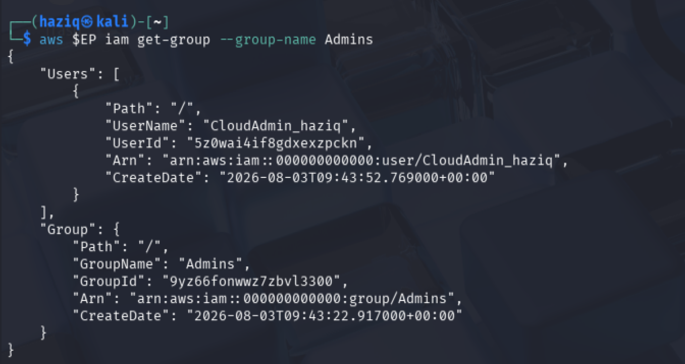
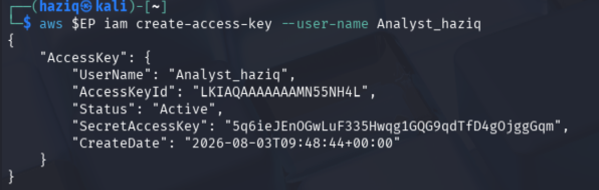
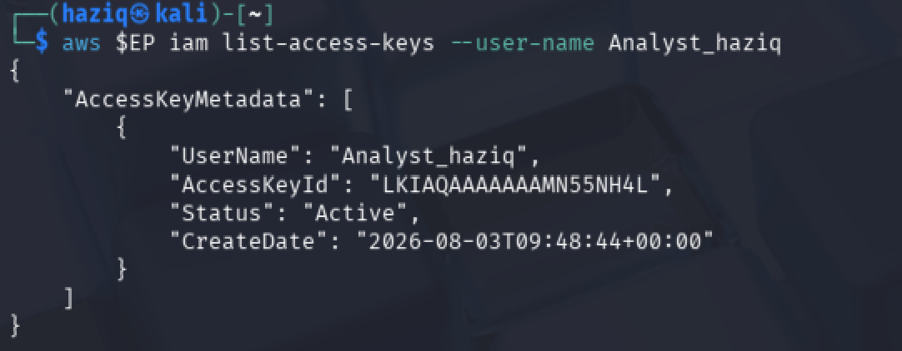
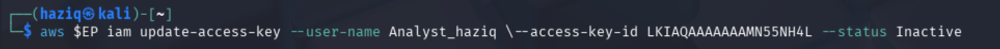
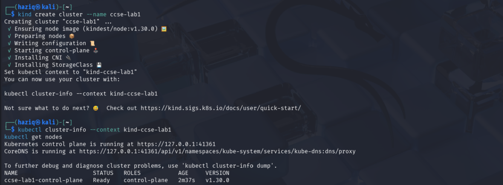

# IKB42603 – Lab 1: Cloud Account Security, Identity & Access Management

**Course:** IKB42603 Cloud Computing Security Essentials
**Institution:** UniKL MIIT
**Lab:** Cloud Account Security, IAM (LocalStack) & Kubernetes RBAC — Weeks 1–2

This report documents my work for Session A (LocalStack IAM) and Session B
(Kubernetes RBAC), including terminal output screenshots and the short-answer
questions from the lab manual.

---

## Session A (Week 1) — Cloud Identity with LocalStack

> Tasks 1–4: environment setup, least-privilege admin, scoped read-only policy,
> access key hygiene.

| # | Screenshot | What it should show |
|---|------------|----------------------|
| 1 | `screenshots/01.png` | Environment setup |
| 2 | `screenshots/02.png` | Environment setup |
| 3 | `screenshots/03.png` | `sts get-caller-identity` output |
| 4 | `screenshots/04.png` | Task 2 – create Admins group / attach policy |
| 5 | `screenshots/05.png` | Task 2 – create `CloudAdmin_*` user |
| 6 | `screenshots/06.png` | Task 2 – add user to group |
| 7 | `screenshots/07.png` | Task 2 – `get-group` verification |
| 8 | `screenshots/08.png` | Task 3 – create `Analyst_*` user |
| 9 | `screenshots/09.png` | Task 3 – attach S3 read-only policy |
| 10 | `screenshots/10.png` | Task 3 – `list-attached-user-policies` |
| 11 | `screenshots/11.png` | Task 4 – create access key |
| 12 | `screenshots/12.png` | Task 4 – `list-access-keys` |
| 13 | `screenshots/13.png` | Task 4 – deactivate/rotate key |

---

## Session B (Week 2) — Kubernetes RBAC

> Tasks 5–7: namespaces, Role + RoleBinding, `kubectl auth can-i` verification.

| # | Screenshot | What it should show |
|---|------------|----------------------|
| 14 | `screenshots/14.png` | Task 5 – namespaces created (`dev`, `prod`) |
| 15 | `screenshots/15.png` | Task 6 – service account + Role created |
| 16 | `screenshots/16.png` | Task 6 – RoleBinding created |
| 17 | `screenshots/17.png` | Task 7 – `kubectl auth can-i` results (YES/NO/NO) |
| 18 | `screenshots/18.png` | Verification – `kubectl get rolebinding ... -o yaml` |

---

## Short-Answer Questions

**Q1. Why is attaching policies to groups better than attaching them directly to users?**

_(your answer here)_

**Q2. What is the difference between an IAM User and an IAM Role?**

_(your answer here)_

**Q3. Explain least privilege using the Analyst account, and how it reduces blast radius if compromised.**

_(your answer here)_

**Q4. In Kubernetes, what is the difference between a Role and a RoleBinding?**

_(your answer here)_

**Q5. Why did the developer service account fail to access `prod`, and which security principle does that demonstrate?**

_(your answer here)_

---

## Security Best-Practices Checklist

- [ ] Root user is not used for daily tasks (a dedicated admin identity exists)
- [ ] Permissions are granted via groups/roles, not directly to individual users
- [ ] At least one least-privilege (read-only) identity was created and tested
- [ ] Access keys were listed and a rotation (deactivate) was demonstrated
- [ ] Kubernetes RBAC blocks an unauthorised action (delete / cross-namespace)

---

## References

- Course lectures — Weeks 1, 2, 5, 7
- LocalStack documentation — docs.localstack.cloud
- Kubernetes RBAC — kubernetes.io/docs/reference/access-authn-authz/rbac
